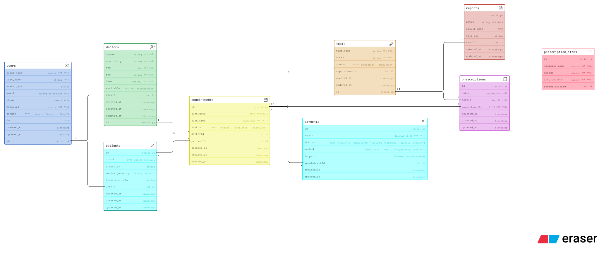

### Health Clinic management



# Healthcare DB Schema

A relational database schema for a doctor appointment and patient management system.

---

## Tables

### People

| Table      | Description                                                                        |
| ---------- | ---------------------------------------------------------------------------------- |
| `users`    | Base account for all humans in the system — stores auth, contact, and profile info |
| `doctors`  | Doctor profile linked to a user — speciality, fees, experience                     |
| `patients` | Patient profile linked to a user — medical history, allergies, insurance           |

### Appointments & Billing

| Table          | Description                                                     |
| -------------- | --------------------------------------------------------------- |
| `appointments` | A booked slot between a doctor and patient — date, time, status |
| `payments`     | Payment record for an appointment — amount, method, status      |

### Clinical

| Table                | Description                                                             |
| -------------------- | ----------------------------------------------------------------------- |
| `tests`              | A medical test ordered during an appointment                            |
| `reports`            | Result of a test — notes, JSON data, or file attachment                 |
| `prescriptions`      | Prescription written during an appointment, optionally linked to a test |
| `prescription_items` | Individual medicines under a prescription — dosage and instructions     |

---

## Relations

```
users ──────────── doctors          one user is one doctor
users ──────────── patients         one user is one patient

doctors ─────────< appointments     a doctor has many appointments
patients ────────< appointments     a patient has many appointments

appointments ────< payments         an appointment has many payments
appointments ────< tests            an appointment can have many tests
appointments ──── prescriptions     an appointment has one prescription

tests ─────────── reports           one test has one report
tests ─────────── prescriptions     a test can optionally link to a prescription

prescriptions ───< prescription_items   a prescription has many medicines
```

---

## Key Design Decisions

- `users` is the single source of identity — doctors and patients extend it via FK
- `prescriptions` anchor to `appointmentId` (required) and `testId` (optional) — a prescription can exist without a test
- `payments` is a separate table — payment status is never stored on `appointments`
- Soft deletes (`deleted_at`) on `users`, `doctors`, `patients`, `appointments`, and `prescriptions` to preserve medical history
