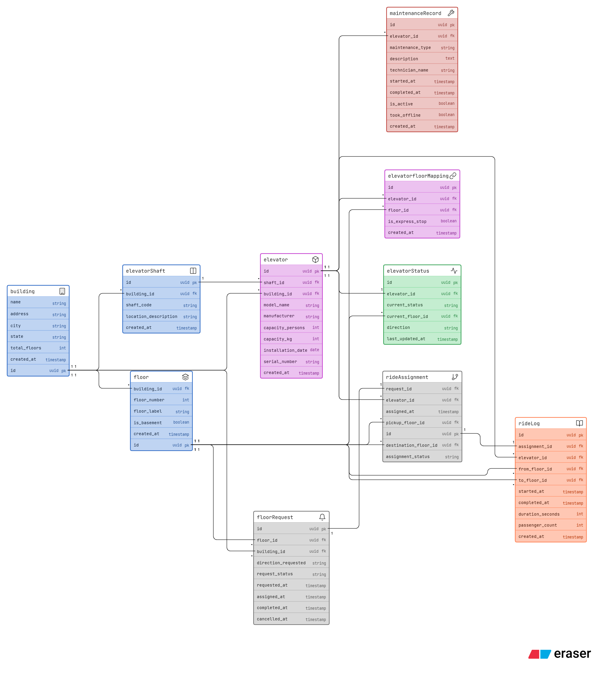

# LiftGrid Systems — Database Design

Smart elevator control platform managing multiple buildings, elevators, floor requests, ride assignments and maintenance records.

---

## Tables

### Infrastructure

**Building** — top-level container. Every other entity traces back to a building via foreign key.

**Floor** — belongs to a building. Floor numbers are scoped per building, so floor 5 in Building A and floor 5 in Building B are distinct records.

**ElevatorShaft** — the physical slot in a building wall. One shaft holds one elevator at a time.

**Elevator** — the actual cabin. Belongs to a shaft and a building. Stores only static config: model, capacity, serial number, installation date. No dynamic data lives here.

---

### Configuration

**ElevatorFloorMapping** — bridge table solving the many-to-many between elevators and floors. One elevator can serve many floors; one floor can be served by many elevators. Also carries `is_express_stop` for skip-floor scenarios.

---

### Operational State

**ElevatorStatus** — one row per elevator, updated in real time. Tracks current status (`idle`, `moving_up`, `moving_down`, `door_open`, `maintenance`, `disabled`), current floor and direction. Kept separate from the elevator table so static config and live state never mix.

---

### Request Lifecycle

**FloorRequest** — created when a user presses a call button on a floor. Tracks direction (`up`/`down`), status (`pending`, `assigned`, `completed`, `cancelled`) and timestamps for each transition. A pending request has no assignment yet.

**RideAssignment** — created when the system picks an elevator for a request. Links one request to one elevator with pickup and destination floors. A request without an assignment row is still pending.

---

### History

**RideLog** — immutable record written after a trip completes. Stores from-floor, to-floor, duration and passenger count. Never updated — append only. Used for analytics and usage reporting.

**MaintenanceRecord** — append-only log of every maintenance event per elevator. Each event is its own row. `took_offline` flags whether the elevator was disabled; `is_active` marks ongoing work. History is never overwritten.

---

## Relationships

```
Building
├── has many Floors
├── has many ElevatorShafts
└── has many Elevators

ElevatorShaft
└── has one Elevator

Elevator
├── serves many Floors (via ElevatorFloorMapping)
├── has one ElevatorStatus (live state)
├── has many RideAssignments
├── has many RideLogs
└── has many MaintenanceRecords

Floor
├── belongs to Building
├── can be served by many Elevators (via ElevatorFloorMapping)
└── can generate many FloorRequests

FloorRequest
└── leads to one RideAssignment

RideAssignment
└── produces one RideLog
```

---

## Key Design Decisions

| Decision                                                           | Reason                                                                                                            |
| ------------------------------------------------------------------ | ----------------------------------------------------------------------------------------------------------------- |
| ElevatorStatus is a separate table                                 | Live state changes constantly; static config should not be overwritten                                            |
| ElevatorFloorMapping is a bridge table                             | Elevators and floors have a true many-to-many relationship                                                        |
| FloorRequest, RideAssignment and RideLog are three separate tables | Each represents a distinct lifecycle stage; collapsing them makes pending-request queries and analytics difficult |
| MaintenanceRecord is append-only                                   | Full history must be preserved; disabling an elevator adds a row, it does not modify the elevator record          |
| RideLog is immutable                                               | Analytics require a stable historical record that is never edited                                                 |

---

## Query Examples

| Question                               | How to answer                                                      |
| -------------------------------------- | ------------------------------------------------------------------ |
| How many elevators in a building?      | Count `Elevator` rows by `building_id`                             |
| Which floors can elevator X reach?     | Query `ElevatorFloorMapping` by `elevator_id`                      |
| All pending requests right now?        | `FloorRequest` where `request_status = pending`                    |
| Rides completed today?                 | `RideLog` filtered by `completed_at` date                          |
| Is elevator X under maintenance?       | `MaintenanceRecord` where `elevator_id = X` and `is_active = true` |
| Which elevator handled the most rides? | Aggregate `RideLog` group by `elevator_id`                         |
