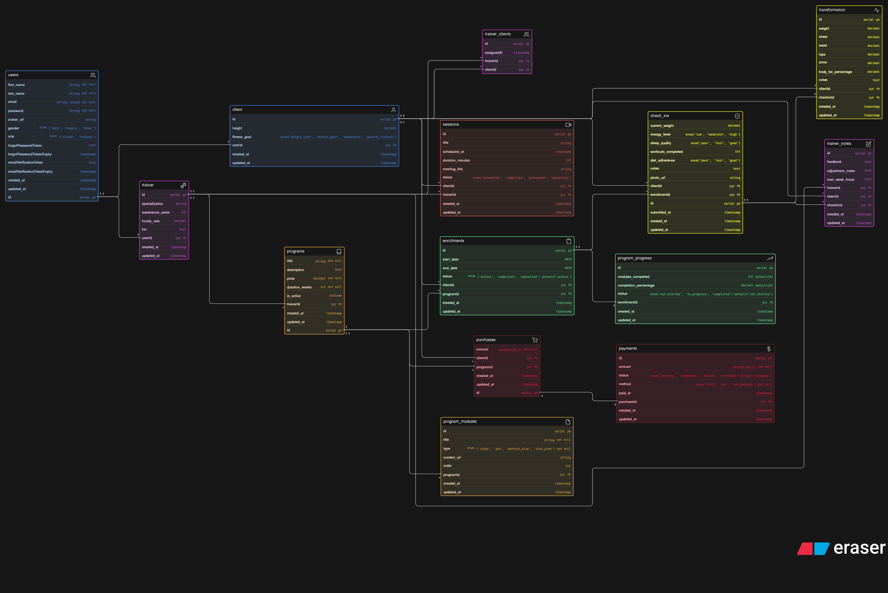

### Fitness Influencer DB Design Challenge

# 🏋️‍♂️ Online Fitness Coaching Platform – Database Design

This project represents the database design for an **online fitness coaching platform** where trainers provide structured programs, track client progress, and manage consultations.

---

## 📌 Overview

The system supports:

* Trainers managing multiple clients
* Clients enrolling in multiple fitness programs
* Program-based coaching (workout, diet, videos, etc.)
* Weekly check-ins and transformation tracking
* Live sessions / consultations
* Payments and purchases

---

## 🧩 Core Entities

### 👤 Users & Roles

* **users**
  Stores authentication and basic user information.
  Each user can be either a **client** or a **trainer**.

* **client**
  Extended profile for clients (height, fitness goal).

* **trainer**
  Extended profile for trainers (specialization, experience, bio).

* **trainer_clients**
  Maps trainers to clients (many-to-many relationship).

---

### 📦 Programs & Content

* **programs**
  Represents coaching plans created by trainers.
  Includes pricing, duration, and ownership.

* **program_modules**
  Individual units inside a program (videos, PDFs, workout plans, diet plans).

👉 One program → Many modules

---

### 📊 Enrollments & Progress

* **enrollments**
  Tracks which client is enrolled in which program.
  Includes start date, end date, and status.

* **program_progress**
  Tracks overall progress of a client in a program.

👉 One client can enroll in multiple programs over time
👉 One program can have multiple clients

---

### 📈 Check-ins & Transformation

* **check_ins**
  Weekly reports submitted by clients.
  Includes weight, energy, sleep, adherence, and notes.

* **transformation**
  Detailed body measurements captured per check-in.

* **trainer_notes**
  Feedback given by trainers on client check-ins.

👉 Flow:
Client → Check-in → Trainer Feedback → Progress improvement

---

### 🎥 Sessions (Consultations)

* **sessions**
  Represents scheduled meetings between trainer and client.
  Includes meeting link, time, duration, and status.

👉 One trainer can handle many sessions
👉 One client can attend multiple sessions

---

### 💳 Payments

* **purchases**
  Represents a client’s intent to buy a program.

* **payments**
  Stores transaction details (status, method, amount).

👉 One purchase → One payment (can be extended to multiple)

---

## 🔗 Relationships Summary

* A **user** can be a **client or trainer**
* A **trainer** can manage multiple clients
* A **client** can enroll in multiple programs
* A **program** can have multiple clients
* Each **enrollment** tracks lifecycle (start → end)
* Each **check-in** belongs to a client and enrollment
* Each **check-in** can have:

  * One transformation record
  * Multiple trainer notes
* **Sessions** connect trainers and clients
* **Payments** are linked to purchases

---

## 🧠 Design Highlights

* Separation of **auth (users)** and **profiles (client/trainer)**
* Clear distinction between:

  * **Enrollment (access)**
  * **Purchase (payment intent)**
* Time-based tracking via:

  * Check-ins
  * Transformation logs
* Modular program structure (scalable content delivery)

---

## 🚀 Future Improvements

* Role-based access control (RBAC instead of enum roles)
* Linking enrollments with payments for better integrity
* Module-level progress tracking
* Subscription upgrades / pause / renew support
* Notifications system for reminders

---
