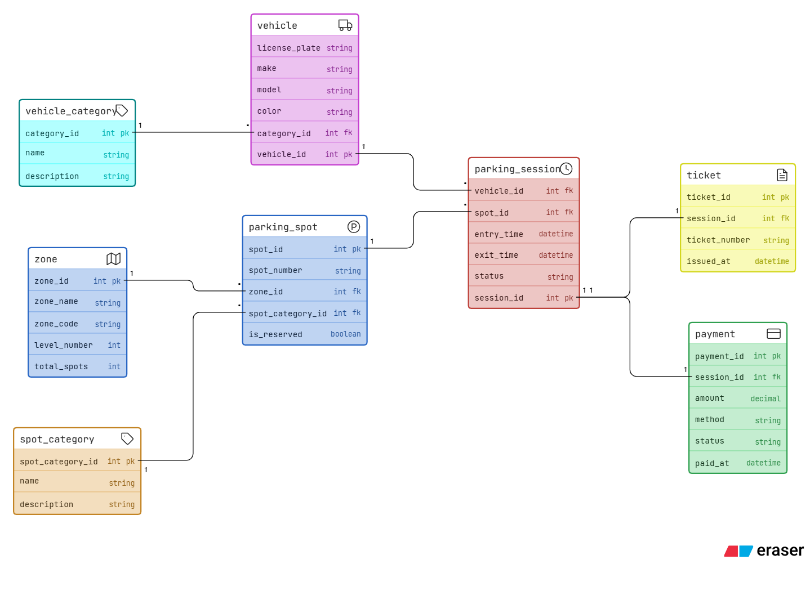

## Parking



# Comic-Con India — Parking System ERD

A multi-zone event parking system for tracking vehicles, spot allocation, sessions, tickets, and payments across the venue.

---

## Tables

| Table              | Purpose                                                                              |
| ------------------ | ------------------------------------------------------------------------------------ |
| `vehicle_category` | Lookup table for vehicle types — bike, car, SUV, EV, cab                             |
| `vehicle`          | Registered vehicles identified by license plate                                      |
| `zone`             | Parking zones/levels in the venue (e.g. Zone A, Level 2)                             |
| `spot_category`    | Lookup table for spot types — general, VIP, EV charging, exhibitor, staff, cosplayer |
| `parking_spot`     | Individual spots with a zone, category, and reservation flag                         |
| `parking_session`  | One row per visit — links a vehicle to a spot with entry/exit timestamps             |
| `ticket`           | Issued at entry for each session; carries a unique ticket number                     |
| `payment`          | Billing record per session — amount, method, and payment status                      |

---

## Relationships

```
vehicle_category  ──< vehicle
vehicle           ──< parking_session
parking_spot      ──< parking_session
zone              ──< parking_spot
spot_category     ──< parking_spot
parking_session   ──  ticket
parking_session   ──  payment
```

- A **vehicle** belongs to one **vehicle_category** (e.g. EV)
- A **parking_spot** belongs to one **zone** and one **spot_category**
- A **parking_session** records one visit — one vehicle, one spot, one time window
- Each session generates exactly one **ticket** and one **payment**
- One vehicle can have many sessions (multiple visits across event days)
- One spot can serve many sessions over time (reused across visits)

---

## Key Design Notes

- `exit_time` is nullable on `parking_session` — null means the vehicle is currently parked
- `is_reserved` on `parking_spot` flags permanently reserved spots (VIP, staff, EV, etc.)
- Availability is derived: a spot is free if it has no active session (no exit time)
- Fees are calculated from session duration and recorded on `payment`
