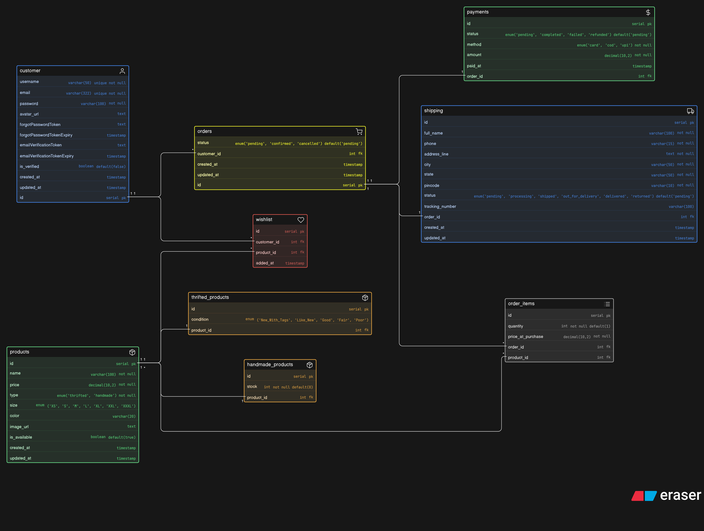

# 🛍️ Thrift & Handmade Store — Database Design

A database design for a small Instagram-based store selling thrifted fashion items and handmade products. Supports product management, inventory tracking, orders, payments, and shipping.

---

## 📦 Entities Overview

| Entity              | Description                                        |
| ------------------- | -------------------------------------------------- |
| `customer`          | Store users who browse and place orders            |
| `products`          | Base table for all products (thrifted or handmade) |
| `thrifted_products` | Extends products with condition detail             |
| `handmade_products` | Extends products with stock/quantity               |
| `orders`            | A purchase event by a customer                     |
| `order_items`       | Individual products within an order                |
| `payments`          | Payment info linked to an order                    |
| `shipping`          | Delivery address and status for an order           |
| `wishlist`          | Products saved by a customer for later             |

---

## 🔗 Relationships

```
customer      →(1:M)→   orders
orders        →(1:M)→   order_items
order_items   →(M:1)→   products
orders        →(1:1)→   payments
orders        →(1:1)→   shipping
customer      →(1:M)→   wishlist
wishlist      →(M:M)→   products
products      →(1:1)→   thrifted_products
products      →(1:1)→   handmade_products
```

---

## 🧩 Entity Details

### `customer`

Stores user account information.

- Auth fields: `email`, `password`, `username`
- Token fields: `forgotPasswordToken`, `emailVerificationToken` with expiry timestamps
- `is_verified` — tracks email verification status

### `products`

Base table shared by all product types.

- `type enum('thrifted', 'handmade')` — determines which detail table to reference
- `is_available` — soft flag to mark sold-out or unlisted products without deleting them
- Common attributes: `name`, `price`, `size`, `color`, `image_url`

### `thrifted_products`

Extends `products` for thrifted items.

- `condition enum` — one of: `New_With_Tags`, `Like_New`, `Good`, `Fair`, `Poor`
- Always a single unique piece (no stock field needed)
- Links back via `product_id (FK)`

### `handmade_products`

Extends `products` for handmade items.

- `stock int` — number of units available
- Can have multiple pieces
- Links back via `product_id (FK)`

### `orders`

Represents a customer's purchase event.

- `status enum('pending', 'confirmed', 'cancelled')`
- Does not store product info directly — uses `order_items` for that

### `order_items`

Junction table between `orders` and `products`.

- Resolves the many-to-many between orders and products
- Stores `quantity` and `price_at_purchase` (price may change over time, so snapshot is important)

### `payments`

Stores payment info for an order.

- `method enum('card', 'cod', 'upi')`
- `status enum('pending', 'completed', 'failed', 'refunded')`
- `amount` — total amount paid
- `paid_at` — exact timestamp of payment

### `shipping`

Stores delivery address and shipment tracking for an order.

- Full address fields: `address_line`, `city`, `state`, `pincode`
- `status enum` — tracks: `pending → processing → shipped → out_for_delivery → delivered → returned`
- `tracking_number` — optional courier tracking

### `wishlist`

Saves products a customer is interested in.

- Junction table between `customer` and `products`
- `added_at` — timestamp of when item was wishlisted

---

## 🗂️ Design Patterns Used

| Pattern           | Where Used                                             |
| ----------------- | ------------------------------------------------------ |
| Supertype–Subtype | `products` → `thrifted_products` / `handmade_products` |
| Junction Table    | `order_items`, `wishlist`                              |
| Snapshot Pricing  | `price_at_purchase` in `order_items`                   |
| Soft Delete       | `is_available` in `products`                           |

---

## 📐 Key Design Decisions

- **Thrifted vs Handmade** are not separate product tables — they share a common `products` base table and extend it via `thrifted_products` and `handmade_products`. This avoids duplication and keeps queries clean.
- **Order items** are separate from orders to support multiple products per order.
- **Payments and shipping** are separate from orders to keep each entity focused and normalized.
- **Price at purchase** is stored in `order_items` so historical order data remains accurate even if product price changes later.
